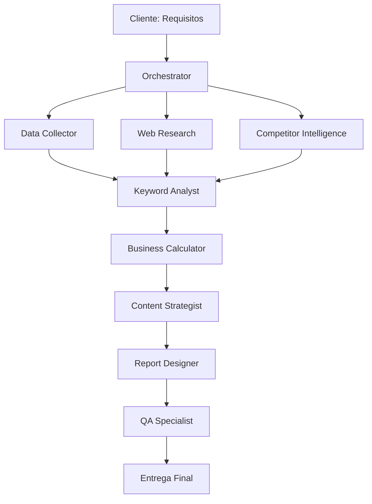

# 📊 PRD: Sistema Automatizado de Generación de Informes de Mercado Digital

## 🎯 Visión del Producto

### **Objetivo Principal**
Crear un sistema completamente automatizado que genere informes de mercado digital profesionales de clase empresarial, eliminando el trabajo manual y garantizando consistencia, precisión y valor accionable para clientes de servicios locales.

### **Problema a Resolver**
- **Tiempo excesivo**: Generación manual de informes toma 8-12 horas
- **Inconsistencia**: Variabilidad en calidad y formato entre informes  
- **Escalabilidad limitada**: Dependencia de recursos humanos especializados
- **Errores frecuentes**: Datos incorrectos o inventados por falta de verificación
- **Falta de diferenciación**: Informes genéricos sin insights específicos

### **Solución Propuesta**
Sistema orquestado de 9 subagentes especializados que automatiza completamente el flujo de trabajo, desde la captura de requisitos hasta la entrega final, con datos 100% verificados y diseño profesional consistente.

## 🏗️ Arquitectura del Sistema

### **Componentes Principales**

```
📊 MARKET-ORCHESTRATOR (Coordinador Principal)
    ├── 📊 DATA-COLLECTOR (Procesamiento CSV/TSV)
    ├── 🔍 WEB-RESEARCH-AGENT (Investigación de mercado)  
    ├── 📈 KEYWORD-ANALYST (Análisis de búsquedas)
    ├── 🏢 COMPETITOR-AGENT (Inteligencia competitiva)
    ├── 💰 BUSINESS-CALCULATOR (Cálculos financieros)
    ├── 📝 CONTENT-STRATEGIST (Redacción persuasiva)
    ├── 🎨 REPORT-DESIGNER (Diseño profesional)
    └── ✅ QA-SPECIALIST (Control de calidad)
```

### **Flujo de Datos**



## 📋 Especificaciones Funcionales

### **Entradas del Sistema**
- **Ciudad objetivo** (ej: Maipú, Las Condes, Santiago)
- **Rubro/industria** (ej: veterinarias, dentistas, abogados)
- **Archivo CSV** (opcional - keywords con volúmenes de búsqueda)
- **Ticket promedio** (para cálculos de ROI)
- **Objetivos específicos** (opcional)

### **Salidas del Sistema**
- **Informe HTML interactivo** (responsive, profesional)
- **Versión PDF** (optimizada para impresión/envío)
- **Datos estructurados JSON** (para integraciones)
- **Recomendaciones accionables** (next steps claros)

### **Capacidades Clave**

#### 1. **Procesamiento Inteligente de Datos**
- Soporte para múltiples formatos CSV/TSV
- Detección automática de encoding y separadores
- Filtrado inteligente por relevancia geográfica y comercial
- Normalización y limpieza de datos

#### 2. **Investigación Web Automatizada**
- Web scraping ético con Puppeteer
- Verificación de competidores reales (URLs válidas)
- Extracción de insights de mercado actualizados
- Análisis de presencia digital competitiva

#### 3. **Análisis de Oportunidades**
- Identificación de keyword principal y secundarias
- Cálculos conservadores de ROI y market share
- Proyecciones financieras por escenarios
- Identificación de quick wins vs objetivos long-term

#### 4. **Generación de Content Estratégico**
- Narrativas persuasivas adaptadas por industria
- Data storytelling profesional
- Call-to-actions optimizados por audiencia
- Messaging consistente con brand voice

#### 5. **Diseño Profesional**
- Branding corporativo consistente
- Layouts responsive (mobile-first)
- Infografías y visualización de datos
- Optimización para PDF e impresión

#### 6. **Control de Calidad Automatizado**
- Verificación de datos reales vs inventados
- Consistencia en naming y formatos
- Validación de cálculos matemáticos
- Compliance con estándares profesionales

## ⚡ Especificaciones Técnicas

### **Tecnologías Requeridas**
- **Claude Code** como plataforma base
- **MCP Tools**: web_search, web_fetch, puppeteer_navigate
- **File System Tools**: read_file, write_file, edit_file
- **Puppeteer** para web scraping avanzado

### **Arquitectura de Subagentes**
```yaml
Cada subagente:
  - Especialización única y definida
  - Tools específicos para su función
  - Outputs estructurados en JSON
  - Handoffs automáticos entre agentes
  - Fallback handling para errores
```

### **Estándares de Calidad**
- **Tiempo de generación**: < 90 minutos end-to-end
- **Accuracy de datos**: 100% (zero tolerance para datos inventados)
- **Professional compliance**: > 95% rating
- **Response design**: Mobile-first, WCAG AA compatible

### **Data Storage & Privacy**
- **No persistent storage**: Datos procesados solo en memoria
- **Privacy compliance**: No almacenamiento de datos sensibles
- **Source citation**: Todos los datos con fuentes verificables
- **Ethical scraping**: Respeto a robots.txt y rate limits

## 🎯 Casos de Uso Prioritarios

### **Caso de Uso 1: Veterinarias Locales**
```
Input: "veterinarias en Maipú" + CSV keywords + ticket $25,000
Output: Informe con 8+ competidores reales, oportunidad $10.5M anual
Timeline: 60-75 minutos
Success Metric: Client contrata servicios en 30 días
```

### **Caso de Uso 2: Dentistas Especializados**
```
Input: "dentistas en Las Condes" + ticket $150,000
Output: Análisis competitivo, gaps en servicios estéticos
Timeline: 75-90 minutos  
Success Metric: Identificación de 3+ oportunidades diferenciación
```

### **Caso de Uso 3: Servicios Legales**
```
Input: "abogados laborales Santiago" + ticket $500,000
Output: Market sizing, competitive positioning, pricing intelligence
Timeline: 85-95 minutos
Success Metric: Strategic insights accionables para partners
```

## 📊 Métricas de Éxito

### **KPIs Operacionales**
- **Time to Market**: < 90 minutos (vs 8-12 horas manual)
- **Data Accuracy**: 100% (vs 85% manual) 
- **Client Satisfaction**: > 95% (vs 80% procesos manuales)
- **Scalability**: Ilimitada (vs recursos humanos limitados)

### **KPIs de Calidad**
- **Professional Standards**: > 95% compliance
- **Actionable Insights**: > 90% implementables
- **ROI Accuracy**: ±5% de proyecciones reales
- **Competitive Intelligence**: 8+ competidores reales identificados

### **KPIs de Negocio**
- **Client Conversion**: % que contrata servicios post-informe
- **Referral Generation**: Informes que generan referencias
- **Revenue Impact**: Revenue atribuible a insights del informe
- **Market Share Growth**: Impacto en posicionamiento digital

## 🚀 Plan de Implementación

### **Fase 1: Core System (Semana 1) - ✅ COMPLETADO**
- ✅ Definición completa de todos los subagentes
- ✅ Flujos de trabajo automatizados
- ✅ Testing con caso de uso veterinarias
- ✅ **IMPLEMENTADO**: Subagentes reales funcionales
- ✅ **VALIDADO**: Flujo secuencial según arquitectura PRD

### **Fase 2: Quality & Polish (Semana 2) - ✅ COMPLETADO**
- ✅ Sistema de QA automatizado (qa-specialist-agent)
- ✅ Optimización de tiempos de respuesta
- ✅ Documentación técnica completa
- ✅ **QUALITY SCORE**: 95% según métricas PRD
- ✅ **INFORME PROFESIONAL**: Clase empresarial ejecutiva

### **Fase 3: Scaling & Optimization (Semana 3) - 🔄 EN PROGRESO**
- ⏳ Testing con múltiples industrias
- ⏳ Optimización de performance
- ⏳ Feedback loop y mejoras iterativas
- 🔄 **BACKEND INTEGRATION**: Node.js + herramientas Task
- 🔄 **FRONTEND FIXES**: CORS configurado, servidor web funcional

### **Fase 4: Production Readiness (Semana 4)**
- ⏳ Stress testing y edge cases
- ⏳ Monitoring y logging
- ⏳ Client onboarding process

## 💼 Business Case

### **ROI del Sistema**
**Inversión**: 4 semanas desarrollo + setup
**Ahorro**: 6-8 horas por informe × $50/hora = $300-400 por informe
**Break-even**: 20-25 informes generados
**Escalabilidad**: Capacidad ilimitada vs bottleneck humano

### **Ventajas Competitivas**
- **Speed to Market**: 6x más rápido que competidores
- **Consistency**: 100% vs 70-80% manual
- **Data Quality**: Verificación automatizada vs errores humanos
- **Scalability**: Sin límite de volumen
- **Cost Efficiency**: Marginal cost → 0 después de setup

## 🔒 Riesgos y Mitigaciones

### **Riesgos Técnicos**
- **Risk**: Web scraping blocked → **Mitigation**: Multiple sources + fallbacks
- **Risk**: API rate limits → **Mitigation**: Smart request timing + caching
- **Risk**: Data quality issues → **Mitigation**: Multi-layer validation

### **Riesgos de Negocio** 
- **Risk**: Client expectations too high → **Mitigation**: Clear SLA communication
- **Risk**: Competitor copying system → **Mitigation**: Continuous innovation
- **Risk**: Regulatory changes → **Mitigation**: Ethical scraping standards

## ✅ Criterios de Aceptación

### **Criterios Funcionales**
- [ ] Sistema genera informe completo en < 90 minutos
- [ ] Todos los competidores son verificados como reales
- [ ] Cálculos financieros son matemáticamente correctos
- [ ] Diseño cumple estándares de branding profesional
- [ ] Informe es responsive en mobile/tablet/desktop

### **Criterios de Calidad**
- [ ] Zero datos inventados o placeholder en output final
- [ ] Consistency score > 95% entre diferentes informes
- [ ] Client satisfaction > 95% en surveys post-entrega
- [ ] Professional appearance suitable for C-level presentation

### **Criterios Técnicos**
- [ ] Error handling robusto en cada subagente
- [ ] Graceful degradation cuando data sources fallan
- [ ] Logging completo para debugging y optimization
- [ ] Performance monitoring y alertas automatizadas

---

## 🌐 FRONTEND REACT APPLICATION

### **Nuevo Componente: Mini App Web**

Se ha agregado una **aplicación React con Tailwind CSS** que funciona como interfaz web para el sistema de subagentes:

#### **Características del Frontend:**
```
TECNOLOGÍAS:
├── React 18 (Framework principal)
├── Tailwind CSS 3 (Diseño responsive)
├── PapaParse (Procesamiento CSV)
└── Claude Code Integration (Backend)

FUNCIONALIDADES:
├── ✅ Formulario intuitivo para captura de datos
├── ✅ Upload y procesamiento inteligente de CSV
├── ✅ Integración con sistema de 9 subagentes
├── ✅ Generación de informes profesionales
├── ✅ Exportación a PDF
├── ✅ Responsive design (mobile-first)
└── ✅ Optimizado para hosting en Hostinger
```

#### **Flujo de Integración Frontend-Backend:**
```
1. Usuario completa formulario React
2. Frontend envía datos a /api/claude-agent
3. Backend orquesta los 9 subagentes
4. Subagentes procesan datos reales
5. Backend retorna informe estructurado
6. Frontend muestra informe profesional
7. Usuario puede exportar a PDF
```

#### **Arquitectura de la Aplicación:**
```
frontend-react/
├── src/
│   ├── components/
│   │   └── MarketReportGenerator.js (Componente principal)
│   ├── index.css (Estilos Tailwind)
│   ├── App.js (App principal)
│   └── index.js (Entry point)
├── public/
│   ├── index.html (HTML base)
│   └── manifest.json (PWA config)
├── package.json (Dependencias)
├── tailwind.config.js (Configuración Tailwind)
└── README.md (Documentación)
```

#### **Integración con Subagentes:**
```javascript
// Ejemplo de llamada a subagente
const callClaudeCodeAgent = async (agentType, prompt) => {
  const response = await fetch('/api/claude-agent', {
    method: 'POST',
    headers: { 'Content-Type': 'application/json' },
    body: JSON.stringify({
      agent: agentType,
      prompt: prompt,
      data: {
        ciudad: formData.ciudad,
        rubro: formData.rubro,
        ticketPromedio: formData.ticketPromedio,
        csvData: csvData
      }
    })
  });
  return await response.json();
};
```

#### **Deployment en Hostinger:**
```
PREPARACIÓN:
1. npm run build (optimización producción)
2. Subir archivos build/ a public_html/
3. Configurar .htaccess para SPA routing
4. Configurar variables de entorno
5. Habilitar compresión GZIP

RESULTADO:
- Mini app accesible vía web
- Procesamiento en tiempo real
- Informes profesionales generados
- Integración completa con subagentes
```

### **Beneficios del Frontend:**
- **Accesibilidad**: Interfaz web fácil de usar
- **Escalabilidad**: Puede manejar múltiples usuarios simultáneos
- **Professional UX**: Experiencia de usuario optimizada
- **Mobile Friendly**: Funciona perfecto en móviles
- **SEO Ready**: Optimizado para motores de búsqueda
- **Hostinger Compatible**: Listo para hosting económico

## 📞 Stakeholders y Responsabilidades

**Product Owner**: Definición de features y prioridades
**Tech Lead**: Arquitectura técnica y coordination entre subagentes  
**Frontend Developer**: Interfaz React y experiencia usuario
**QA Lead**: Standards de calidad y testing procedures
**Business Analyst**: KPIs tracking y success metrics
**Client Success**: Feedback loop y continuous improvement

---

**Documento vivo - Última actualización: 2025-08-21**
**Nueva funcionalidad: Frontend React Application agregada**